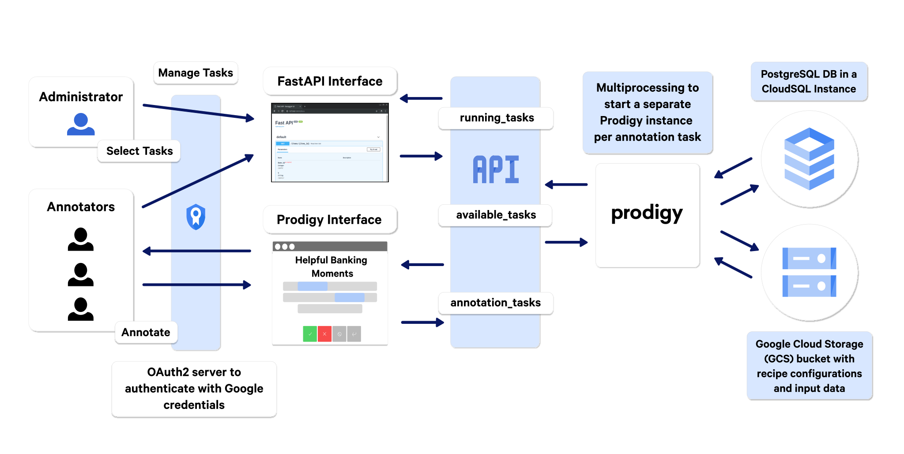

#

Copy .env.example , values in .env.example are for `flytectl demo` default postgres/etc

## setup

NB: django>=6.0 only supports >=3.12

```sh
brew install python@3.12

# to build psycopg2 get 
# brew install libpq

# to link psycopg2 against 
# brew install openssl
export LDFLAGS="-L/opt/homebrew/opt/openssl/lib"
export CPPFLAGS="-I/opt/homebrew/opt/openssl/include"

cd site-example 
uv sync --no-managed-python \
--all-packages 
```

## k8s cluster

create a cluster with a specific k3s version <https://github.com/k3d-io/k3d/discussions/474#discussioncomment-335175> or

```sh
curl -s https://raw.githubusercontent.com/k3d-io/k3d/main/install.sh | bash

k3d cluster create mycluster
```

and then

~~disable traefik etc <https://github.com/waybarrios/k3d-nginx-ingress?tab=readme-ov-file#step-1-install-kubernetes>~~

and <https://k3d.io/v5.3.0/usage/exposing_services/>

### flytectl demo

Get k8s cluster eg like this

```sh
brew tap flyteorg/homebrew-tap
brew install flytectl

# to restart 
# flytectl demo teardown -v
flytectl demo start --version v1.16.3

```

That starts this version of k3s:

```sh
> k version
Server Version: v1.29.0+k3s1
```

## maybe Get matching version of kubectl

v1.31.5 is `k3d cluster create mycluster`

```sh
# -s is silent
sudo bash -c 'curl -Ls https://dl.k8s.io/v1.31.5/kubernetes-client-darwin-arm64.tar.gz | tar xOvf - --strip-components=3 kubernetes/client/bin/kubectl > /usr/local/bin/kubectl && chmod +x /usr/local/bin/kubectl '
```

or via brew

```sh
brew tap homebrew/core --force
brew edit kubernetes-cli@1.29
#and comment out line like this 
# # disable! date: "2025-02-28", because: :deprecated_upstream

```

## other implementations

<https://explosion.ai/blog/posh-prodigy-financial-chatbots>


