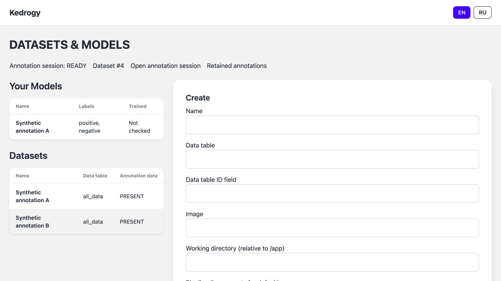
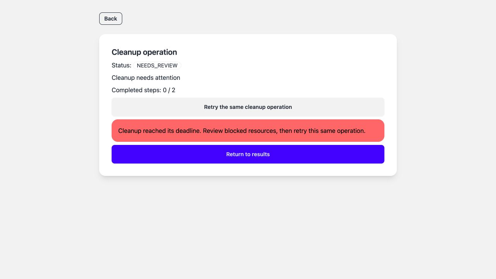
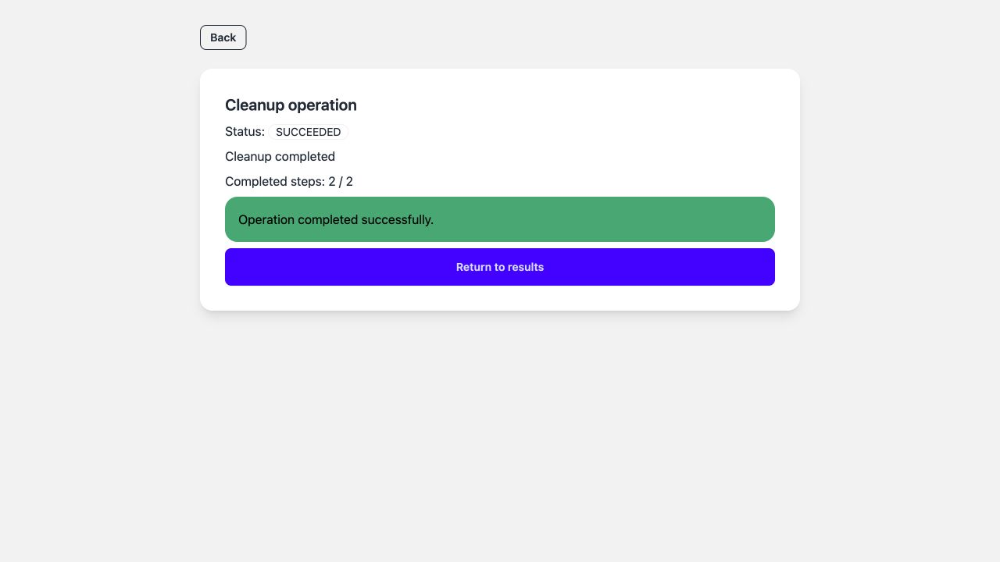

# Implementation of audit findings 13–16

Date: 2026-09-26. The approved lifecycle plan is implemented. Application text,
new code, comments, tests and documentation are in English. Authentication remains
intentionally deferred. The working app runs at http://localhost:5173 with its API
on port 8002.

## What changed

| Finding | Result |
| --- | --- |
| 13 — annotation status | Each dataset has its own saved-answer observation, separate from the health of a durable annotation session. One session owns each namespace's annotation slot. |
| 14 — task results | Annotation and cleanup status comes from persistent domain records. Failed or interrupted work remains visible; cleanup shows completed steps and an explicit retry action. |
| 15 — deletion | A signed, expiring preview fixes the scope. Cleanup checks ownership and exact Kubernetes UIDs, persists progress, waits for actual removal, and retires application records only after cleanup. |
| 16 — recovery | Database locks, constraints, request keys, leases, conditional writes and independent reconcilers protect competing operations and recover interrupted work. |

The existing training, serving, artifact, prediction and database-role boundaries
remain in place. The queue has not been replaced, and no historical workload or
annotation set has been automatically deleted.

## Annotation data and sessions

`annotation_data` reports `UNKNOWN`, `EMPTY`, `PRESENT` or `INVALID`, counts stored
accepted/rejected/ignored/invalid answers, and records observation time and safe
errors. The compatibility `labelled` field is true only for a fresh `PRESENT`
observation. It no longer depends on `DjangoLastDataset`. The legacy table remains
for migration compatibility; maintained status consumers no longer use it.

The operations reconciler processes at most five due datasets per pass. It batches
identity/count queries, validates at most the configured annotation limit per
dataset in a consistent read-only transaction, and never returns annotation text
in a status payload. GET/HEAD only read observations. Refresh data counts requests
an independent refresh. Data older than 300 seconds becomes `UNKNOWN`. Counts do
not establish unique texts, completion percentage, class compatibility, or model
quality; training's existing model-specific preflight still makes that decision.

`AnnotationRun` records an immutable launch snapshot, request key, namespace,
resource identities, startup outcome, current health, timestamps and lease. A
transactionally reserved `AnnotationSlot` allows one managed session per namespace.
Duplicate submissions return the same run; competing launches conflict. Display
rename remains allowed, while launch-affecting edits are rejected during a session.

Each run has its own Deployment, immutable ConfigMap and Service. A small health
sidecar checks the actual Prodigy HTTP application and reports the run identity and
dataset key. Readiness also verifies the Deployment UID/generation and rollout,
the stable Prodigy numeric ID, and shared routing. Stale health disables Open.
Startup success is historical and is not rewritten when the session later becomes
unavailable. Stop disconnects routing, deletes only the run's resources, and waits
for its Pods to disappear before releasing the slot. Kubernetes resourceVersion
fences delayed writes to the shared route, including Stop before first activation.

## Reviewed and resumable cleanup

| Action | Effect |
| --- | --- |
| Stop annotation | Removes that session's workloads/configuration and routing; keeps saved answers and source rows. |
| Delete all model files | Removes owned workloads, Jobs, configuration and the entire model PVC; keeps the draft and history. |
| Delete model | Performs the same resource cleanup, then retires the model. |
| Delete dataset | Stops its managed annotation session, cleans its models, then retires records; retains saved annotations by default. |
| Delete retained annotations | Deletes only the explicitly reviewed name/ID/content fingerprint. Other datasets, session datasets, shared examples and source rows remain. |

A preview lists affected model IDs and resource identities, explains retention,
and expires after ten minutes. Submission rechecks the target under locks and
atomically commits the operation, reservations and queue delivery. Active
training, changed dependencies, or unresolved ownership prevent submission.
Parent reservations exclude new child models and new Train/Serve/Label requests.
REST, legacy forms, protected model relationships and administrative restrictions
prevent normal deletion paths from bypassing the workflow.

`DeletionRun` persists `QUEUED`, `RUNNING`, `RETRY_WAIT`, `NEEDS_REVIEW` or `SUCCEEDED`,
the plan, completed steps, task link, error, retry schedule and lease. Kubernetes
removal uses exact namespace/kind/name/UID with UID preconditions. A successful
DELETE request is not treated as completion while an object is terminating. A
replacement under the same name is refused. Any Pod referencing a PVC prevents
volume deletion; protection finalizers are never stripped.

Transient failures use bounded retries and backoff. A cleanup attempt has a
900-second deadline; blocked cleanup becomes visible `NEEDS_REVIEW` and keeps its
reservation. Retry resumes the same operation and restarts its attempt deadline.
The model and dataset pages link back to unfinished cleanup. A changed UID,
changed annotation fingerprint, or missing cleanup Job with an unrecorded outcome
requires investigation; Retry does not silently adopt a different resource or
broaden the approved scope.

Retired records remain as tombstones for replay and status lookup. Artifact
removal is recorded separately from historical training success, and a removed
artifact cannot be served. Per-version removal within a shared model PVC remains
outside this stage; the UI explicitly says **all model files**.

The installed Prodigy deletion helper can include associated session datasets.
The new narrow adapter avoids that behavior. It locks the relevant annotation
tables with bounded timeouts, rechecks identity and the reviewed fingerprint,
deletes only the selected dataset's links and row, then removes only examples
that have no remaining links. It rejects structured datasets and malformed
metadata. Cleanup uses the pinned approved adapter image and can still run when
a retired dataset's old source or recipe configuration is no longer usable.

## Recovery and operation reporting

Annotation startup and current runtime health are separate. Cleanup progress is
an observed step count, not an estimated percentage. The status API uses domain
records before queue-delivery results and never reads a failed task's return value.
React validates incoming payloads, retains the last result during a connection
failure, aborts obsolete requests, and distinguishes status retry from operation
retry. Legacy result pages expose the same failures and cleanup retry behavior.

Database lock order is slot where required, dataset, ordered models, then operation
records. External calls remain outside reservation transactions. Leases allow a
new owner to recover, while conditional observations and Kubernetes identities
protect against delayed old workers. New annotation and deletion queue deliveries
perform one observation; the independent reconciler can finish the operation
without the originating queue worker or browser tab.

All three watch-mode reconcilers recover after a Django database outage. Local
startup supervises the queue worker with a five-second restart delay; Kubernetes
uses restartable sidecars. Historical RUNNING deliveries are not bulk-requeued.
Old annotation/deletion task formats without durable identity fail safely before
launching resources. The read-only `operation_inventory --resources` command
reports queue links, cleanup reservations, retained data and resource identities.

## Verification

**122 automated test cases passed**, plus the isolated integration checks below.

| Check | Result |
| --- | --- |
| Django domain/API/legacy regressions | 86 passed |
| Real PostgreSQL concurrency | 10 passed: duplicate requests, competing slots, transaction rollback, Train/Delete and parent Delete/Create races |
| TypeScript runtime contracts | 15 passed |
| Real tiny-checkpoint inference, artifact integrity and secret serialization | 11 passed |
| Frontend | TypeScript and Vite production build passed |
| Source checks | Focused Ruff, migration drift check and `git diff --check` passed |
| Migration | Forward, backward and forward again on populated synthetic records; original labels/relationships preserved and no active session invented |
| Installed images | Edited lifecycle module and migration hashes match files inside the final images |

The normal image build stalled in Docker's credential helper. For this stage,
changed source layers and compiled frontend assets were rebuilt on the verified
09–12 dependency images already cached locally, then pushed to the existing local
registry. No dependency change or password prompt was required. A clean dependency
rebuild from the original Dockerfiles was not completed in this stage.

The disposable namespace `kedrogy-check-20260926` and PostgreSQL container contained
only synthetic data. The acceptance workflow:

1. Started A, saved a real Prodigy answer through the browser, stopped A, started B,
   and saved another answer. Both datasets reported their own saved-answer counts,
   while Home named B as the active session.
2. Mounted an isolated model volume in a synthetic Pod. Cleanup reached
   `NEEDS_REVIEW` without deleting that volume or releasing its reservation.
3. Removed the test consumer and killed a cleanup process after the external
   removal but before its progress commit. After injecting expiry of the killed
   owner's lease, an independent observer completed the same operation. The test
   does not claim that six minutes of real lease time elapsed.
4. Retired the fixture datasets and verified that both annotation sets remained.
   Explicitly purged A and checked that B remained. A later separately authorized
   fixture purge of B also worked after its source/image configuration retired;
   all five source rows remained.
5. Verified that a real Kubernetes update prepared before Stop is rejected by the
   changed resourceVersion. Mock-only ownership checks were not the sole evidence.
6. Observed the real React `NEEDS_REVIEW` screen and clicked Retry the same cleanup
   operation. The same URL/ID subsequently showed `SUCCEEDED` and 2/2 completed steps.
7. Deployed the built images, with five ready backend containers. A 15-second outage
   of only the disposable PostgreSQL container left all three reconciler processes
   alive; data observation resumed after reconnecting.
8. Verified actual network denial from an unapproved Pod and allowed HTTP routes
   through web → Django, including the SPA cleanup route and legacy preview.

The local K3s firewall issue from the previous stage recurred after Docker startup:
all three initial denial probes could connect despite installed policies. Restarting
the existing node restored enforcement. Final probes denied backend Service,
backend Pod and web Service access; legitimate HTTP requests passed afterward.
This is an environment recovery, not a fix to K3s itself.

## Working environment and remaining decisions

Migration `0014_durable_annotation_cleanup` is applied to the working database.
The API, queue worker, training reconciler, serving reconciler, operations
reconciler and frontend are running with the updated local configuration. The
annotation link is configured for the actual k3d ingress port, 8081.

The working inventory contains **84 resource identities**, no READY/RUNNING queue
deliveries, and no pending durable cleanup. Seven candidate resources associated
with current model records have unresolved ownership: PVC/Deployment/Service/Job
for model 20, and PVC/Service/Job for model 19. Other historical objects are listed
for review; a matching name alone is not proof that deletion is authorized.

The existing unmanaged `Deployment/prodigy` remains in place. A new managed Label
operation deliberately refuses to take it over; it must be explicitly reviewed
and stopped before switching to managed annotation. This implementation does not
silently interrupt the historical session.

Model 20 remains `artifact_status=INVALID`, `trained=false`, `served=false`.
Ambiguous historical bindings and the P/N versus sentiment-label decision remain
unresolved. Authentication, model quality, reject/OTHER semantics, multi-session
annotation capacity, and automatic historical garbage collection are outside the
approved scope.

The disposable namespace/database, fixture credentials, test browser tabs and
temporary listeners are removed after acceptance. Working records, annotations,
source tables, historical workloads and volumes are retained. Built images and
safe evidence remain. No public deployment, commit or pull request was created.

## Evidence

- [Runtime lifecycle and route fencing](lifecycle-runtime.json)
- [Browser acceptance](browser-acceptance.json)
- [Disposable fixture cleanup](fixture-cleanup.json)
- [Database outage recovery](database-recovery.json)
- [Final network-denial checks](deployment-network.json)
- [Allowed HTTP routes](deployment-http.json)
- [Working resource/task inventory](local-inventory.json)
- [Working local status](local-status.json)
- [Pinned image digests](release-images.json)
- [Installed package hashes](installed-packages.json)
- [Startup and operational instructions](../../SECURITY_SETUP.md)
- [Approved plan and installed plugin guidance](../2026-09-25-implementation/PLAN_FIXES_13_16.md)

The implementation follows the linked Python robustness/concurrency, PostgreSQL
DDL, E2E concurrency, TypeScript runtime-validation and UX controls guidance.

