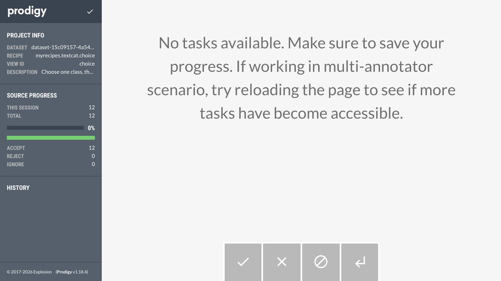

# P1 repair implementation report

Date: 2026-09-26. Scope: R01, R02, R11 and R14 from the [execution plan](../2026-09-26-audit/PLAN_R01_R02_R11_R14.md).

All four findings are fixed for the new workflow and verified with real PostgreSQL, Kubernetes, stored browser annotations, training and inference. The working local project has received additive migrations and source privilege changes and is running with the updated code. Historical annotations, source rows and workload specifications were preserved. Authentication remains deferred.

This is a report on these four repairs, not a claim that every issue in the previous project audit has been resolved.

## Findings and implementation

| Finding | Status | Result |
| --- | --- | --- |
| R01: serving takes over matching resource names | Fixed | New resources belong to an immutable per-run plan. Namespace identity, creation intent, exact owner UID, saved resource UID and intended specification are checked. Foreign objects are neither replaced nor deleted. |
| R02: delayed old serving worker interferes with a newer run | Fixed | Per-run Services isolate routing; lease epochs and database-time expiry fence publication. Stop invalidates eligibility before cleanup. Terminal tombstones collect late old creates. |
| R14: imports replace source tables and positional IDs | Fixed | Managed append-only sources, string upstream IDs or an explicit content policy, stable UUIDs, transactional staging and durable replay receipts. Runtime credentials cannot update/delete/drop existing source data. |
| R11: rejected suggestions manufacture OTHER targets | Fixed | New annotation datasets require one explicit class choice. Reject/Ignore produce no training target. Shared preflight/training conversion and versioned artifact/prediction mapping enforce this throughout the workflow. |

### R01 and R02: serving resources and delayed workers

`ServingRun` now stores `resource_layout`, `resource_plan`, `lease_epoch` and `cleanup_observed_at`. Migration 0015 preserves historical rows as `legacy-fixed-v1`; new controller-created runs use `run-owned-v2`.

New Deployment, Service and anchor names derive exclusively from the ServingRun UUID. The UUID primary key supplies the unique allocation identity; editable names are not part of resource naming. The saved plan includes a creation nonce, intended documents/fingerprints, resource UIDs and the actual Kubernetes namespace UID. An immutable ConfigMap anchors exact dependent owner references.

Creation uses create-or-observe. A lost database acknowledgment can recover an existing object only when its durable intent, owner and intended specification match. A recorded resource that disappears is reported as lost. A same-name replacement with a different UID or specification is a conflict. Normal operation does not patch an arbitrary matching object into the desired shape.

Prediction resolves the current READY run's Service, checks training/serving/class identities, then rechecks current-run eligibility after inference. Stop increments the lease epoch, revokes the old lease and removes prediction eligibility before external cleanup. Progress, readiness, errors, UID publication and lease release are conditional on the correct owner/epoch/state. Kubernetes and HTTP calls remain outside database lock transactions.

Stopped and failed v2 runs remain cleanup tombstones. Cleanup checks owned resources and actual Pod absence. It cannot clear the current pointer or modify a newer run. Model deletion inventories all saved serving runs. Historical resources with incomplete ownership evidence require review.

### R14: immutable source identity and transactional imports

The new `kedrogy_source` schema contains collections, immutable records and import receipts. The schema/migrator owns these objects. The ingest role receives SELECT/INSERT on records and receipts, without UPDATE/DELETE/TRUNCATE, object ownership or schema creation. Readers remain read-only. The source-only setup does not rotate passwords.

Imports preserve upstream IDs as strings, including leading zeros. UUIDv5 combines the source UUID and external key. Content-addressed identity requires an explicitly registered policy and includes exact text/provenance. Duplicate identities fail unless identical duplicates are explicitly deduplicated with a recorded count. Existing keys with changed content reject the entire import; corrections require another source namespace/version.

The importer bounds file/row/text/metadata sizes, serializes imports into a source with a transaction-scoped advisory lock, stages input, checks conflicts and commits new records plus the receipt together. Input reordering retains the fingerprint. A retry with the same key/input returns the original receipt. Importing a subset does not remove earlier records. Failures before receipt insertion roll back new records.

The destructive SQLTableDataset output is removed. The default Kedro pipeline has no import side effects. The approved reader emits source/record IDs, content digest and identity-policy metadata, and annotation exclusion matches both source and record identity. Dataset source configuration and annotation semantics freeze when annotation starts. This also closes the adjacent source-rebinding mechanism identified in R15; it is not a claim that all unrelated R15 concerns have been re-audited.

Legacy `all_data` remains intact and read-only. A new counts-only legacy source preview reports missing/duplicate IDs and empty text without claiming that old positional IDs were reliable upstream keys. No historical source copy was selected or performed.

### R11: annotation, training, artifacts and prediction

New datasets use the approved `myrecipes.textcat.choice` recipe with exclusive choices and explicit acceptance. Source identity participates in Prodigy hashing, so identical text from distinct records is retained. Accept requires exactly one configured class. Reject and Ignore are excluded from training; an explicitly configured OTHER class is handled like any other selected class.

The shared contract package validates choices, provenance, duplicates, conflicts and class support. Preflight and the training worker use the same conversion and fingerprint. Training requires at least four distinct usable records and at least two per class, with a stratified split. Fingerprints bind policy, ordered class schema, annotation content, dataset identity and provenance. Oversized class schemas fail before launching a Job.

New artifacts use class IDs `0..N-1` in the saved class order. Artifact verification, inference startup, API responses, React parsers and the legacy HTML page enforce the same mapping. Boolean/floating/string values cannot masquerade as integer schema versions. Known v1 artifacts retain their original class-zero OTHER mapping. New training on legacy binary answers requires policy review; historical answers are not silently reinterpreted.

| Discriminator | Historical value | New value |
| --- | --- | --- |
| Serving layout | `legacy-fixed-v1` | `run-owned-v2` |
| Annotation policy | `reject-other-v1` | `single-label-choice-v2` |
| Artifact/class schema | 1: `[OTHER, ...labels]` | 2: configured labels only |
| HTTP prediction envelope | 1 | 1, with explicit `class_schema_version: 2` |
| Source identity | Preserved legacy ID/provenance | `upstream-id-v1` or explicitly registered `content-addressed-v1` |

Migration 0016 adds source configuration and annotation policy while preserving the legacy policy on existing rows. New rows default to v2. A counts-only annotation-policy preview identifies exact accepted labels, unresolved answers and rejects requiring reannotation. Automatic P/N aliases and historical answer rewrites are deliberately absent.

## Verification results

The final automated total is **158 passing tests, no skips in the final suites**:

| Gate | Result | Evidence |
| --- | --- | --- |
| Django/backend on PostgreSQL 18 | 107 passed | [Backend log](backend-postgres18-tests.log) |
| ML, data adapters, source transactions, real inference and process shutdown | 35 passed | [ML/data log](ml-postgres18-tests.log) |
| Node API/runtime parser tests | 16 passed | [Frontend tests](frontend-tests.log) |
| TypeScript and production frontend build | Passed | [Build log](frontend-build.log) |
| Django migration drift | No changes detected | `makemigrations --check --dry-run` |
| Python compilation and whitespace checks | Passed | `compileall` and `git diff --check` |
| Critical installed modules vs source | Exact bytes matched | [Image file hashes](image-module-verification.json) |

The backend suite includes populated historical-data migration checks, reverse/forward migration before new-format writes, real PostgreSQL concurrency, lease takeover/release fencing, ownership conflicts and deterministic stale-worker tests. Some unit tests isolate external boundaries with mocks; the acceptance run below supplies the actual external-system evidence.

The source suite checks replay, order changes, subsets, appends, duplicate handling, conflicting-batch rollback, a database failure after record insertion, concurrent replay, overlapping imports with distinct request keys, namespace separation, source-aware exclusion and direct SQL privilege denial. The actual supervisor test launches a worker and descendant, sends SIGTERM and verifies that neither survives.

ESLint was not a passing gate: the repository's existing missing ESLint configuration remains a tooling limitation. TypeScript compilation is not described as an ESLint run.

### Real browser → database → training → serving acceptance

Tests used a dedicated PostgreSQL 18 container/database and Kubernetes namespace `kedrogy-p1-20260926`. Working user data was not copied into the fixture.

1. Registered synthetic source `5981c6fd-60bb-4a6b-96cc-62305ea90ece` and imported 12 records. Reversing/retrying the input retained 12 records and returned receipt `85251b66-1d76-4c88-b0b7-58597a59992e`.
2. Opened the actual Prodigy application and selected/saved 12 answers through the browser. The 12 source identities included repeated text; none were lost through text-only deduplication.
3. Read the saved answers through backend preflight: 12 usable, six positive, six negative, zero invalid/conflicting answers, zero duplicate accepted identities. Fingerprint: `6e3f39ce8c2362f0b46c19d02a006377bc98cff3fc363730b070c87b24e518a1`.
4. Ran the real Kedro training Job using an offline tiny BERT checkpoint for one training step, published the artifact and verified its files/mapping in the verification Job. Training run: `2fd097a6-f62c-4fb3-a7ef-551d25d294df`.
5. Served and predicted through a per-run Service. Class zero was returned as `positive`, with artifact/class-schema version 2 and matching training/serving IDs.
6. Paused an old worker immediately before its real Deployment create; expired its lease; stopped it; made the replacement READY; then resumed the old create. The replacement remained current, and late old resources were collected.
7. Predicted through replacement run `f85d7eac-6e6f-4f72-8227-1a898de9899f`. Its Deployment UID `10274dd6-7ee3-4ded-b0fb-a8b0cb565c3c` and Service UID `71dcf3c6-9d12-401f-b8bb-909f31b782f2` remained unchanged.
8. Created unrelated ConfigMap, Deployment and Service fixtures at expected serving names. Every conflict was rejected; UIDs and specifications/data were preserved.

The synthetic one-step model verifies plumbing and label mapping, not sentiment accuracy. In particular, both sample inference calls returned class zero; this is not evidence of a useful trained classifier.

Full receipts, hashes, predictions, preserved foreign UIDs and race trace: [runtime acceptance](runtime-acceptance.json), [execution log](runtime-acceptance.log).

Saved browser evidence:

### Integration failures found and fixed during implementation

- Prodigy's `instructions` setting expects an instructions file, not inline help text. The recipe now uses its supported description field.
- The real FasttextDataset returns a DataFrame; the initial stratified split incorrectly treated it as a list of dictionaries. The split now uses the catalog's actual contract, with a regression covering save/load/split.
- A blocked legacy cleanup POST returned HTTP 200 for its preview. It now returns 409 while preserving the review page.
- Immediate process-group signaling from the supervisor's signal handler could race with shutdown signaling. The handler now requests shutdown; the supervisor performs process-group termination/reaping in one cleanup path. The real process test passes.

Earlier failed attempts are retained as evidence in `runtime-first-attempt.log` and `backend-postgres18-first-attempt.log`; they are not included as successful verification results.

## Images and local rollout

Images were built from verified cached release layers with network-disabled builds and pushed only to the local registry:

| Image | Digest |
| --- | --- |
| `mykedro` | `sha256:b76286a6e858e4c8bd887eb0e0ae55206539699a30c89ff50e00eb14d8446026` |
| `mysite` | `sha256:36d937972c2a4c0178195b58b63e20bb07e23804e173e23afef53bcdd119d2fd` |
| `web` | `sha256:3a95591f6db5c86751147d8aeccae55a51aeade9a97ff996f3c9c9ba41ed35c0` |

[Digest manifest](release-images.json). Critical backend, recipe, training, source, contract, inference and compiled frontend files were compared byte-for-byte with the images.

The local cutover verified that no old API/queue/reconciler process was active. Inventory found no READY/RUNNING historical queue deliveries and no pending cleanup. It then:

- Applied Django migrations 0015 and 0016 to the existing local `mysite` database.
- Installed managed source tables and transferred `all_data` ownership to `kedrogy_migrator`, retaining reader access.
- Confirmed that legacy rows remained **200 before and 200 after**, with the same aggregate content checksum.
- Confirmed ingest can INSERT managed records, cannot UPDATE managed records, and cannot DELETE legacy rows.
- Added GET permission for the exact `default` namespace identity, with no namespace mutation permission; refreshed the existing scoped controller token.
- Updated the private environment's ML digest and retained previous approved image aliases.
- Confirmed all inventoried pre-existing workload UIDs and specifications/data were unchanged.
- Started the updated local API, queue worker, training/serving/operation reconcilers and Vite frontend. API health, frontend and frontend API proxy returned HTTP 200, and the browser loaded the working datasets/models page.

The local backend/frontend run from this checkout. Their container images are built and verified; no Kubernetes backend/frontend Deployment was installed as part of this local cutover. New Kubernetes ML operations use the approved ML digest.

Open the project at [http://127.0.0.1:5173](http://127.0.0.1:5173). Local service logs and process IDs are under `.local/p1-services/`. Details: [rollout](local-rollout.json), [resource inventory](local-inventory.json), [service checks](local-services.json), [legacy source preview](legacy-source-preview.json).

The disposable acceptance namespace, its dedicated RBAC, PostgreSQL container/anonymous volume and native test PostgreSQL process were cleaned up/stopped. Working default-namespace workloads and project processes were retained. [Cleanup receipt](fixture-cleanup.json).

## Remaining historical decisions and limits

1. Historical P/N versus positive/negative label mapping remains unresolved. This release does not infer aliases or rewrite classifier weights. Invalid historical checkpoints, including the previously flagged model 20 artifact, are not automatically repaired by these changes.
2. The unmanaged `prodigy` Deployment remains intact. Starting managed annotation in the working namespace requires reviewing and explicitly stopping that old annotation workload. The new workflow was demonstrated in the isolated namespace.
3. Old fixed-name serving resources/PVCs/Jobs lack complete recorded ownership. The inventory still reports review requirements for resources associated with historical models 19 and 20. Automatic cleanup/adoption is intentionally blocked.
4. Historical `all_data` has no missing/duplicate IDs in the preview, but its IDs have not been proven to be stable upstream identifiers. New imports should use registered managed sources. No historical corpus copy or answer conversion was selected.
5. Authentication/password login remains deferred. Existing working database passwords were not rotated. The scoped Kubernetes token is time-limited and will require normal refresh when it expires.
6. Eventual cleanup requires the reconciler and Kubernetes control plane to be available; Stop's immediate prediction fence does not depend on synchronous Kubernetes deletion.

Operational commands, input formats, compatibility rules and rollback guidance are documented in [Source and model contracts](../../SOURCE_AND_MODEL_CONTRACTS.md). After v2 data exists, use a compatible release or roll forward; do not run an old controller or destructive importer against the new state. No commit, pull request or public deployment was created.
